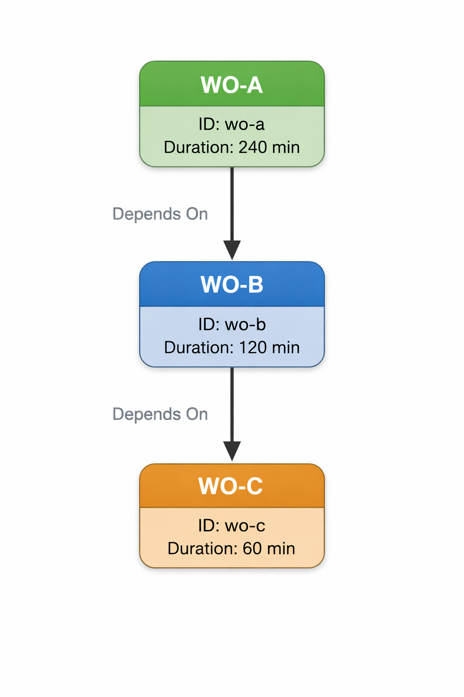
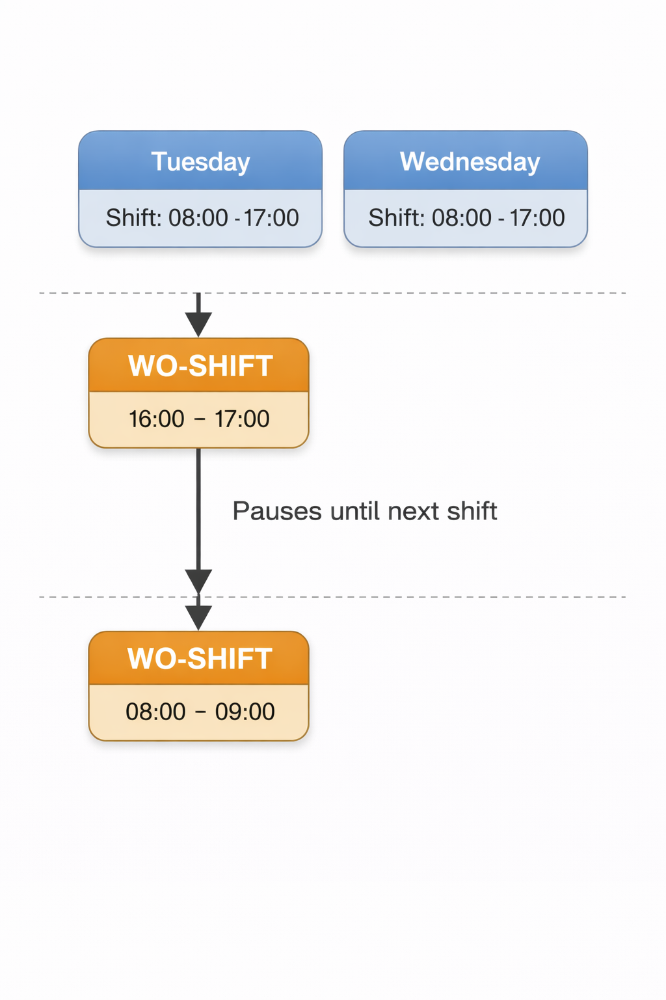
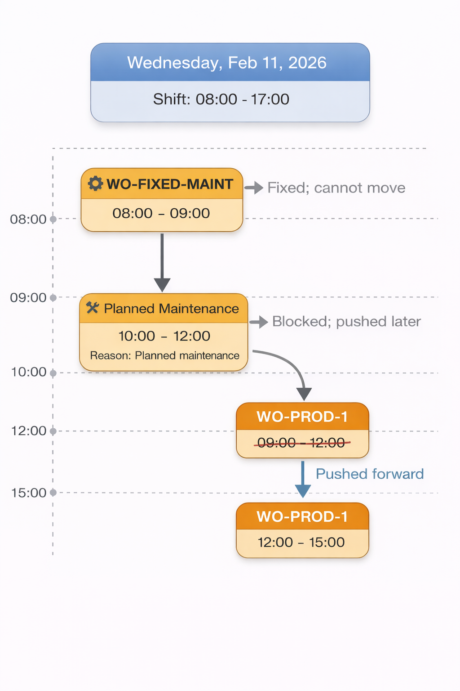

# aps-schedule-reflow

This repo implements a **finite-capacity production schedule reflow engine** for a manufacturing facility (extrusion lines producing plastic pipes).

It takes an existing schedule of work orders and repairs it under disruptions while enforcing hard constraints:

- **Dependencies (multi-parent precedence):** all parents must finish before a child can start
- **Work center conflicts:** one work order at a time per work center (**no overlaps**)
- **Shift calendars:** work consumes **working minutes only**; pauses outside shift hours and resumes next shift
- **Maintenance windows:** blocked resource time that cannot be used
- **Maintenance work orders are immovable:** fixed operations that reserve time and cannot be rescheduled

## Why this exists (ERP → APS context)

In classic ERP planning (MRP/MPS), dates are often computed with **infinite capacity assumptions** (i.e., the machine can do multiple things at once). That produces good *plans* but not always executable schedules.

This project is closer to APS-style scheduling:
- **finite-capacity** (capacity = 1 per work center)
- **precedence constraints** (DAG)
- **resource calendars** (shifts + maintenance)
- and a **reflow / schedule-repair** approach (minimize disruption by adjusting forward to the earliest feasible time)


## Key Concepts

### ERP (Enterprise Resource Planning)

In an ERP context, production execution is typically represented through documents like Manufacturing Orders (MOs) and Work Orders (WOs). A manufacturing order captures what must be produced (item, quantity, due date), while work orders represent the operations required to produce it, often tied to specific work centers or routing steps. Traditional ERP planning (e.g., MRP/MPS) is excellent for planning materials and generating a feasible demand plan, but it often assumes infinite capacity or uses rough-cut assumptions for resources. That means ERP can output planned start/end dates that look reasonable on paper but are not always executable on the shop floor once real constraints such as machine availability, shift calendars, and downtime are considered.

### APS (Advanced Planning & Scheduling) and Reflow

APS systems exist to close that gap by producing finite-capacity schedules that respect real operational constraints. In other words, APS answers: “Given actual resource capacity, calendars, and precedence rules, what schedule can we actually run?” The system built in this repo behaves like an APS schedule repair or reflow engine: it does not attempt to globally re-optimize the entire plan; instead, it takes an existing schedule and repairs it under disruptions by pushing work orders forward minimally while still enforcing constraints. This reflow mindset is common in real manufacturing because schedule stability matters—operators and planners rely on consistent sequences, and frequent reshuffling can be more damaging than small delays.

### Graphs (Modeling Dependencies)

A graph is a mathematical structure used to model relationships. In this domain, each work order can be viewed as a node, and each dependency (“B depends on A”) is represented as a directed connection between nodes called an edge. Using a graph for dependencies is valuable because it cleanly separates “what must happen before what” (precedence logic) from resource allocation (work center capacity and calendars). Once dependencies are expressed as a graph, the scheduling engine can reason systematically about ordering, detect bad input, and compute a correct processing sequence.

### DAG (Directed Acyclic Graph)

In scheduling, dependencies should form a Directed Acyclic Graph (DAG). “Directed” means edges have a direction (A → B), and “acyclic” means there are no loops. A loop would imply an impossible situation—for example, A depends on B while B depends on A. In that case, neither can start, and the schedule has no valid solution. In this repo, the dependency structure is treated as a DAG: the engine builds directed edges from each parent work order to its dependent child, and it rejects cyclic dependency inputs early. This is important because it protects the scheduler from producing invalid output and gives a clear error that the dependency data must be corrected.

### Topological Sort (Ordering Work Correctly)

A topological sort is the standard algorithmic tool for turning a DAG into an ordered list of nodes such that every node appears after all its parents. This is exactly what a scheduler needs: if WO-B depends on WO-A, then WO-A must appear earlier in the scheduling sequence so its end time is known before scheduling WO-B. In this engine, topological sort produces the deterministic “processing order” for work orders. Once that order is computed, the scheduler can walk through it and, for each work order, compute its earliest possible start based on parent completion times. If topological sorting fails to process all nodes, it indicates a cycle, and the engine throws a descriptive error. This behavior is both mathematically correct and operationally useful—cycles are a data-quality issue and must be surfaced explicitly.

### *How these concepts connect in the implementation:*

Putting it all together: ERP provides the business structure (MOs/WOs and planned dates), APS-style reflow ensures real-world feasibility under finite capacity, and graphs provide the formal model for dependency constraints. The dependency graph is assumed to be a DAG; topological sorting converts that DAG into an execution order that guarantees correctness of precedence. After that, resource scheduling becomes a constrained placement problem on each work center’s calendar: work orders are scheduled in topo order at the earliest feasible time that respects shifts, avoids maintenance windows, and does not overlap other work on the same work center.


## Tests

### Case 01 - Delay Cascade (Dependencies A → B → C):
This case models a classic dependency-driven cascade on a single work center with normal weekday shifts and no maintenance. There are three work orders on Extrusion Line 1 with a strict chain: **WO-A → WO-B → WO-C (WO-B depends on WO-A, and WO-C depends on WO-B)**. 

The key disruption is that WO-A’s durationMinutes is 240 minutes (4 hours) even though its original plan shows it ending much earlier, which forces the scheduler to compute a later completion time for WO-A. 

Once WO-A finishes later, WO-B’s earliestStart becomes the max of its planned start and WO-A’s computed end, so WO-B shifts forward. The same rule then shifts WO-C forward based on WO-B’s new end. 

The result is a clean demonstration of APS-style feasibility: dependencies are enforced by scheduling in topological order and pushing downstream work only as much as required by parent completion.



### Case 02 - Shift Boundary (Pause/Resume Across Days):

This case demonstrates that work order duration is measured in working minutes, not wall-clock time. WO-SHIFT starts at 16:00 on Extrusion Line 2, but the shift ends at 17:00, leaving only 60 workable minutes that day. 

Since the work order requires 120 minutes, the scheduler consumes 60 minutes from 16:00–17:00, pauses outside shift hours, then resumes at the next shift start (08:00 the next day) and completes at 09:00. 

The important point is that the scheduler does not treat off-shift time as productive time; it explicitly pauses and resumes based on the shift calendar, which is exactly how production schedules behave in real plants.



### Case 03 - Maintenance Conflict + Fixed Maintenance Work Order (Immovable):

This case shows how the scheduler handles blocked time and immovable operations on Extrusion Line 3. 

The work center has a planned maintenance window from 10:00–12:00, and it also includes an immovable maintenance work order WO-FIXED-MAINT from 08:00–09:00 (isMaintenance: true). The production work order WO-PROD-1 is originally planned 09:00–12:00 with durationMinutes of 180 minutes, but that plan conflicts with the 10:00–12:00 maintenance block. Because the implementation enforces a strict “no overlap” policy for the wall-clock interval [start, end) against maintenance windows, WO-PROD-1 cannot span into the blocked period.

The scheduler therefore pushes WO-PROD-1 to the earliest feasible slot after maintenance—starting at 12:00—and then consumes 180 working minutes to finish at 15:00, while leaving the fixed maintenance work order unchanged.



## Quick Start

Install dependencies:

```bash
npm install
```

Run all scenarios (prints before/after + changes):
```bash
npm run dev
```

Run tests:
```bash
npm run test
```

Type-Check:
```bash
npm run typecheck
```

## Project Structure

```
production-schedule-reflow/
├── src/
│   ├── index.ts
│   ├── reflow/
│   │   ├── constraint-checker.ts
│   │   ├── dag.ts
│   │   └── reflow.service.ts
│   ├── types/
│   │   ├── change.ts
│   │   ├── doc.ts
│   │   ├── index.ts
│   │   ├── manufacturing-order.ts
│   │   ├── reflow-input.ts
│   │   ├── reflow-result.ts
│   │   ├── work-center.ts
│   │   └── work-order.ts
│   └── utils/
│       ├── date.ts
│       ├── format-reason.ts
│       ├── interval.ts
│       ├── logger.ts
│       └── validation.ts
├── test/
│   ├── reflow.spec.ts
│   └── validator.spec.ts
├── data/
│   ├── case-delay-cascade.json
│   ├── case-maintenance-conflict.json
│   ├── case-shift-boundary.json
│   └── content/
│       ├── case-01.png
│       ├── case-02.png
│       ├── case-03.png
│       └── erp-aps-dag.png
├── eslint.config.js
├── jest.config.ts
├── LICENSE
├── package.json
├── README.md
└── tsconfig.json
```

## Production Features

- ✅ **Strict TypeScript** (noUncheckedIndexedAccess, exactOptionalPropertyTypes, noImplicitOverride)
- ✅ **Custom runtime validation** (zero-dependency validator on all inputs)
- ✅ **Jest test suite** (3 scenarios + cycle detection + constraint validation + validator tests)
- ✅ **ESLint + Prettier** (auto-format, strict rules)
- ✅ **GitHub Actions CI** (lint → test → build)
- ✅ **Luxon** for timezone-aware datetime handling
- ✅ **DAG topological sort** with cycle detection
- ✅ **Interval algebra** for reservation merging and overlap checks

## License

Licensed under the MIT License. See [LICENSE](./LICENSE) file for details.

